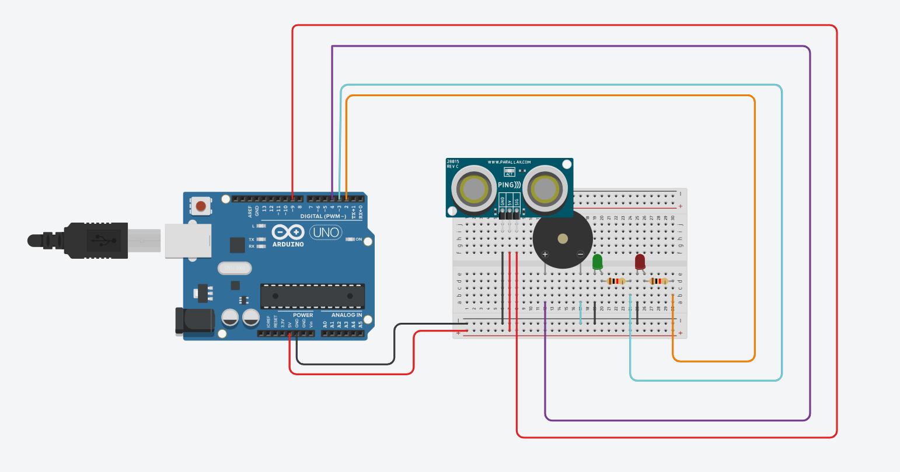
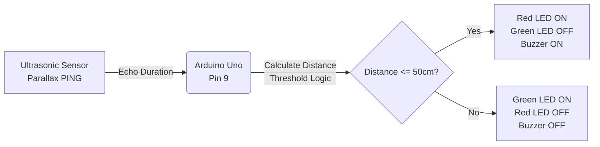

# Project 1 Assignment Submission
**Name:** Erioluwa Gideon Olowoyo  
**GitHub Repository:** https://github.com/Code-with-Gideon/Project-1_Assignment

---

## Question 1: Water Quality Monitoring System

### C Source Code
```c
#include <stdio.h>
#include <math.h>

void classify_water(int index) {
    if (index >= 80) {
        printf("Water Quality Status: Good\n");
    } else if (index >= 60 && index < 80) {
        printf("Water Quality Status: Warning\n");
    } else {
        printf("Water Quality Status: Critical\n");
    }
}

int main() {
    float temperature = 28.5; // Example temperature in Celsius
    float turbidity = 12.0;   // Example turbidity in NTU

    // Using fabs() from math.h because Temperature is a float. 
    // Using standard abs() from stdlib.h would truncate decimals.
    float temp_deviation = fabs(temperature - 25.0);
    float turbidity_penalty = turbidity / 2.0;

    int index = 100 - (int)(temp_deviation + turbidity_penalty);

    printf("===== Water Quality Monitoring Report =====\n");
    printf("Temperature Reading: %.2f C\n", temperature);
    printf("Turbidity Reading: %.2f NTU\n", turbidity);
    printf("Calculated Index: %d\n", index);
    
    classify_water(index);

    return 0;
}
```

### Sample Output
```text
===== Water Quality Monitoring Report =====
Temperature Reading: 28.50 C
Turbidity Reading: 12.00 NTU
Calculated Index: 90
Water Quality Status: Good
```

### Technical Explanation
**a. Real-world application:** C programming is the industry standard for embedded systems because it allows direct manipulation of memory and hardware registers while having an incredibly small runtime footprint. This makes it perfect for microcontrollers (like Arduino) which lack the RAM and processing power of desktop computers.

**b. Error analysis:** 
1. **Syntax Error:** Forgetting a semicolon at the end of a line (e.g., `float temperature = 28.5`). The compiler fails because it violates C's grammar rules.
2. **Semantic Error:** Using `+` instead of `-` in the formula: `100 + (temp_deviation + turbidity_penalty)`. It compiles perfectly, but the logic is flawed and outputs false quality ratings.

**c. Compilation lifecycle:**
1. **Preprocessing:** Removes comments, expands macros, and includes headers (`#include <stdio.h>`). (Input: `.c` source | Output: `.i` expanded source)
2. **Compilation:** Translates C code into target-specific assembly. (Input: `.i` file | Output: `.s` assembly code)
3. **Assembly:** Converts assembly instructions into machine binary code. (Input: `.s` file | Output: `.o` object file)
4. **Linking:** Combines object files with standard libraries (`printf`) into an executable. (Input: `.o` files + libraries | Output: `.exe` executable)

---

## Question 2: Mobile Money Transaction System

### C Source Code
*(Code available in the repository `Question2/q2_mobile_money.c`)*

### Sample Output (Demonstrating Invalid & Valid Operations)
```text
===== MOBILE MONEY TRANSACTION SYSTEM =====
1. Deposit
2. Withdraw
3. Check Balance
4. Transaction Summary
5. Exit
Enter choice: 2
Enter withdrawal amount: 70000
Transaction rejected: Insufficient balance.

===== MOBILE MONEY TRANSACTION SYSTEM =====
...
Enter choice: 1
Enter deposit amount: 15000
Deposit successful.
Current balance: 65000 RWF

===== MOBILE MONEY TRANSACTION SYSTEM =====
...
Enter choice: 4
--- Transaction Summary ---
Successful deposits: 1
Successful withdrawals: 0
```

### Control Flow Explanation
- **Conditionals:** `switch` cleanly routes main menu selections. Nested `if` statements validate constraints (e.g., preventing negative amounts or overdrafts).
- **Loops:** A `while(1)` loop wraps the system, repainting the menu continuously so agents can process multiple transactions without program termination.
- **Continue:** Used to short-circuit invalid inputs. Instead of crashing, `continue` skips the rest of the loop iteration and brings the user straight back to the menu.
- **Break:** Terminates the entire `while` loop when Option 5 is selected, and breaks out of individual `switch` cases.

---

## Question 3: Delivery Distance Analysis

### C Source Code
*(Code available in the repository `Question3/q3_delivery_analysis.c`)*

### Sample Output
```text
===== DELIVERY DISTANCE ANALYSIS =====
Total distance: 140 km
Average distance: 23.33 km
Longest route: 40 km
Routes above 20 km: 3

Recursive sum: 140 km
```

### Functions & Recursion Explanation
- **Function Decomposition:** The program avoids a monolithic `main()` by extracting logic into single-responsibility functions (`calculate_total_distance`, etc.). This promotes reusability, demonstrated by passing the returned `total` directly as an argument to `calculate_average_distance`.
- **Recursion Base Case:** `recursive_sum` takes the array size `n`. The base case is `if (n <= 0) return 0;`. Without this, the function would call itself infinitely and crash.
- **Recursion Logic:** It reduces the problem on each call by returning `distances[n - 1] + recursive_sum(distances, n - 1)`.
- **Advantage:** Recursion produces cleaner, more readable code for mathematical sequence problems compared to iterative loops.
- **Limitation:** It is heavily memory-dependent. Every recursive call adds a new frame to the Call Stack. For massive datasets, this leads to a Stack Overflow crash.

---

## Question 4: Smart Parking System

### 1. Tinkercad Circuit Design


### 2. Block Diagram


### 3. Arduino Source Code
```cpp
// Pins matching Tinkercad wiring
const int pingPin = 9;   // Purple wire
const int buzzerPin = 4; // Light Blue wire
const int greenLED = 3;  // Orange wire
const int redLED = 2;    // Yellow wire

const int thresholdDistance = 50; // cm

void setup() {
  pinMode(buzzerPin, OUTPUT);
  pinMode(greenLED, OUTPUT);
  pinMode(redLED, OUTPUT);
  Serial.begin(9600);
}

void loop() {
  long duration, distance;

  pinMode(pingPin, OUTPUT);
  digitalWrite(pingPin, LOW);
  delayMicroseconds(2);
  digitalWrite(pingPin, HIGH);
  delayMicroseconds(5);
  digitalWrite(pingPin, LOW);

  pinMode(pingPin, INPUT);
  duration = pulseIn(pingPin, HIGH);

  distance = duration / 29.1 / 2;
  
  Serial.print("Distance: ");
  Serial.print(distance);
  Serial.println(" cm");
  
  // Occupancy Logic
  if (distance > 0 && distance <= thresholdDistance) {
    digitalWrite(redLED, HIGH);
    digitalWrite(greenLED, LOW);
    digitalWrite(buzzerPin, HIGH);
  } else {
    digitalWrite(redLED, LOW);
    digitalWrite(greenLED, HIGH);
    digitalWrite(buzzerPin, LOW);
  }
  
  delay(500);
}
```

### 4. Technical Explanation
- **Role of Components:** The Parallax PING))) sensor uses sound waves to measure distance. The Arduino Uno is the microcontroller that processes this data against thresholds. The LEDs and Buzzer act as visual and audio output actuators.
- **Processing Data:** The Arduino sends a 5-microsecond pulse to trigger the sensor, then reads the return echo duration using `pulseIn()`. This duration is converted to centimeters by dividing by 29.1 and then dividing by 2 (for the round trip).
- **Controlling Outputs:** It compares the calculated distance to a hardcoded threshold (50cm). If the distance is under or equal to 50cm, the Arduino writes a `HIGH` signal to Pins 2 and 4 (Red LED & Buzzer) and `LOW` to Pin 3 (Green LED).

### 5. Simulation Test Cases
**Test Case 1: Vehicle outside threshold (e.g., 100 cm)**
- Expected: Green LED ON, Red LED OFF, Buzzer OFF
- Actual: Outputs correctly matched expected state.

**Test Case 2: Vehicle inside threshold (e.g., 30 cm)**
- Expected: Green LED OFF, Red LED ON, Buzzer ON
- Actual: Outputs correctly matched expected state.
